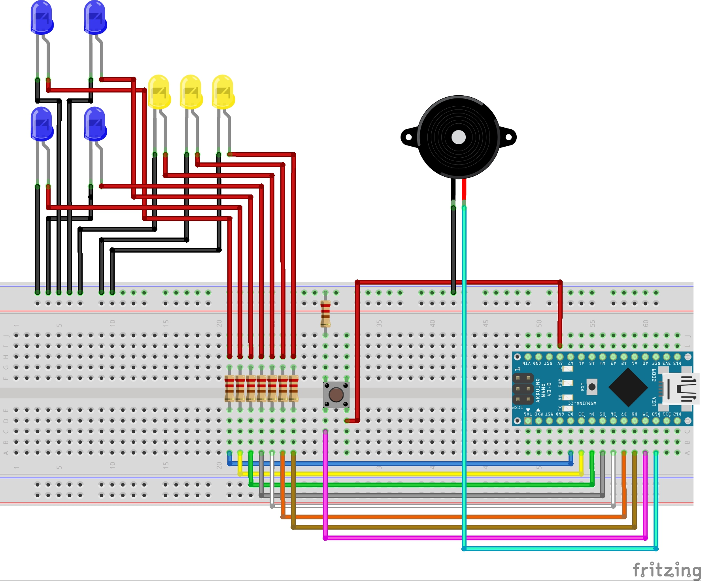
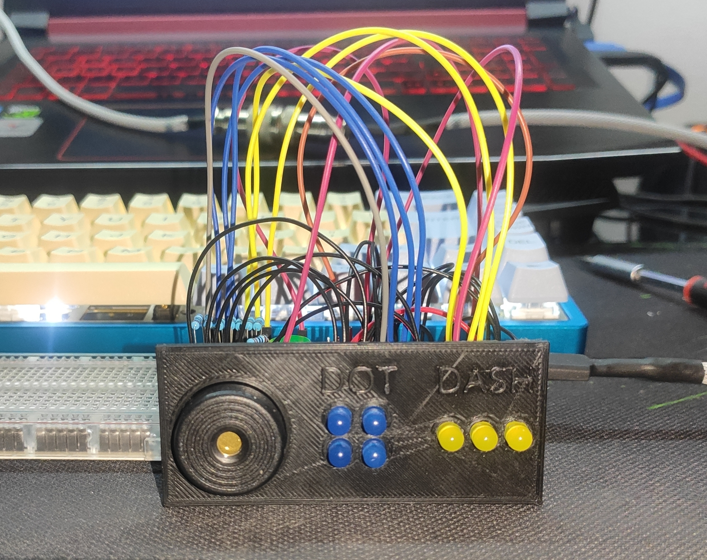

# Morse-Code-Interaction

The Morse Code Interaction is a mini game that was developed for my Master Thesis "Developing a Support Infrastructure for an Escape The Room and Peddy Paper Games".

This mini game, or interaction as I so call it, was developed to be part of an Escape the Room game that was also developed as part of my thesis. Since this interaction can work as a standalone mini game I decided to place it here for anyone interested in using it.

## List of Components

- Blue LEDs (4x);
- Yellow LEDs (3x);
- 220Ω Resistor (8x);
- Button (1x);
- Piezzo Speaker (1x);
- Arduino Nano (1x);

In order to fully assemble the Interaction, so as to look like the picture below, you will also need to 3D Print the enclosure which is divided into two parts that can be found [here](enclosure/).

## The Purpose of The Game

The Morse Code Interaction purpose is to teach Morse Code to people in a very simple way, by simply making the player decipher the morse coded message the the interaction is playing when you press the button.

The way this works is the interaction selects a word from an hardcoded array of words and proceeds to translate that word to morse code with the usage of the piezzo speaker and LEDs for that effect.

### Example

Lets assume for example that the selected word was "Samuel Morse". In this case the interaction would play the sound and light up the LEDs corresponding to the following morse code:

- `... .- -- ..- . .-.. -- --- .-. ... .`

Since this interaction was developed to be used with an infrastructure for the Escape The Room, it is not possible to introduce anything in the interaction or the serial monitor so as to give you a confirmation that the message you introduced is actually the message you heard in morse code. This can be easily achieved with some minor changes to the source code (something I might consider doing in the future and place that modification in a separate branch)

## Instructions

First start by uploading the code to your Arduino Nano (This is the one I used so I can only guarantee proper working with this micro-controller).

### Starting the Game

To start the mini game you must first type in the Arduino IDE serial monitor the following:

- > COM:START;ID:123456789

After this, to play the morse coded message all you have to do is press the button and the message will start playing.

## WARNING

The source code for this interaction contains a lot of logic that was made to communicate with the infrastructure that was developed for my thesis and therefor it is not as clean as it could be when compared to a mini game that is developed with the intent of being used by the Arduino IDE directly.